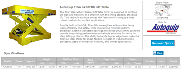
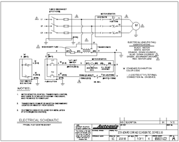
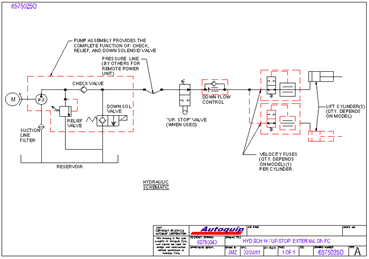

# Opis hidraulične podizne platforme Autoquip Titan Scissors Lift

Ova datoteka opisuje hidrauličnu podiznu teretnu platformu **Autoquip Titan Scissors Lift**, koja će poslužiti kao osnova za kasniju izradu simulatora. Cilj je prije programiranja što preciznije definirati način rada stvarne hidraulične platforme, njezine glavne komponente, međusobne veze i sigurnosne elemente.

Opis se temelji na službenom Autoquip manualu, odabranim električnim i hidrauličnim shemama, te javno dostupnim specifikacijama odabranog modela. Ovdje se opisuje sam lift i njegov način rada, dok će programski dio simulatora biti obrađen zasebno.

## Sadržaj

1. Izvor dokumentacije i svrha analize
2. Odabrani model i osnovna struktura sustava
3. Električni sustav
4. Hidraulični sustav
5. Opis rada platforme
6. Sigurnosni i zaštitni elementi

---

## 1. Izvor dokumentacije i svrha analize

Službeni manual proizvođača dostupan je za preuzimanje na web linku:

[Autoquip Titan Scissors Lift – Owner's Manual](https://autoquip.com/wp-content/uploads/2018/03/Manuals-Titan-Scissors-Lift-V2-5.pdf)

Priručnik obuhvaća više izvedbi Titan škarastih podiznih platformi, pa pojedine električne i hidraulične komponente ovise o modelu, pogonskoj jedinici i dodatnoj opremi. Za simulator je zato odabrana konkretna kombinacija mehaničkih specifikacija, električne sheme i hidraulične sheme.

Princip rada platforme zaključen je na temelju električnih i hidrauličnih shema, opisa pojedinih komponenti, servisnih postupaka i dijagnostike kvarova iz manuala. Tamo gdje ponašanje nije izričito opisano tekstom, zaključak je izveden iz međusobnog odnosa elemenata prikazanih na shemama.

Analiza je prvenstveno usmjerena na normalan rad ispravnog sustava, dok će se simulacija kvarova razmatrati u kasnijim fazama razvoja simulatora. Svrha ove analize je definirati fizičke komponente, radna stanja i funkcionalne odnose sustava koji će poslužiti kao osnova za izradu simulatora.

---

## 2. Odabrani model i osnovna struktura sustava

Kao mehanička i fizikalna osnova simulatora odabran je model **Autoquip Titan 42C8F80** hidraulične teretne platforme.

Specifikacije modela dostupne su web stranici: [Autoquip Titan 42C8F80 – specifikacije](https://www.lift-tables.net/autoquip/titan/42c8f80.php).

Isječak najvažnijih specifikacija prikazan je na sljedećoj slici (klikni na sliku za prikaz u punoj veličini):

[](slike/specifikacije.png)

Ova tablica je bazirana na podacima sa prethodne slike:

| Karakteristika | Vrijednost |
| --- | --- |
| Model | `42C8F80` |
| Hod platforme | 42 in / 107 cm |
| Nosivost | 8000 lb / 3600 kg |
| Minimalna visina | 11.75 in / 30 cm |
| Maksimalna visina | 53.75 in / 137 cm |
| Standardna veličina platforme | 24 × 64 in / 61 × 163 cm |
| Maksimalna veličina platforme | 48 × 96 in / 122 × 244 cm |
| Veličina osnovnog okvira | 24 × 64 in / 61 × 163 cm |
| Maks. dopušteno koncentrirano opterećenje na krajnjem rubu (*end edge load*) | 7000 lb / 3200 kg |
| Maks. dopušteno koncentrirano opterećenje na bočnom rubu (*side edge load*) | 5000 lb / 2300 kg |
| Vrijeme podizanja | 45 s |
| Vrijeme spuštanja | 45 s |
| Broj cilindara | 3 |
| Snaga motora | 1.5 HP / 1.1 kW |
| Masa platforme | 1180 lb / 535 kg |

Nominalno vrijeme od 45 s za puni hod u oba smjera predstavlja fizikalni parametar modela. Tijekom razvoja simulator može kasnije koristiti zaseban vremenski faktor za ubrzano izvođenje, bez promjene nominalnih vrijednosti fizičkog sustava.

---

### 2.1. Osnovna struktura sustava

Na najvišoj razini sustav se može promatrati kao spoj električnog upravljanja, hidrauličnog pogona i mehaničkog sklopa:

```text
UP / DOWN komande
        ↓
električni upravljački sustav
        ↓
motor / DOWN solenoid
        ↓
hidraulični sustav
        ↓
tri hidraulična cilindra
        ↓
škarasti mehanizam
        ↓
platforma
```

Električni sustav određuje hoće li biti pokrenut elektromotor pumpe ili otvoren *DOWN* ventil. Hidraulični sustav zatim stvara protok prema cilindrima ili omogućuje povrat ulja iz cilindara u spremnik. Gibanje cilindara mijenja geometriju škarastog mehanizma, čime se mijenja visina platforme.

Osnovna fizikalna veličina kojom će biti opisan položaj platforme jest **visina platforme**. Stvarni odabrani sustav nema senzor koji kontinuirano mjeri visinu, pa sama visina pripada fizičkom stanju platforme, a ne električnom upravljačkom signalu.

---

## 3. Električni sustav

Odabrani električni sustav temelji se na shemi sa str. 35 manuala. Upravljački krug ima napon 24 VAC (podaci su navedeni u popisu kontrolnih panela na str. 50).

Klikni na sliku za veći prikaz:

[](slike/elektricna_shema.png)

Trofazno mrežno napajanje dovodi se vodovima L1, L2 i L3 preko rastavne skopke s osiguračima (*fused disconnect*) na sklopnik motora. Primar upravljačkog transformatora priključen je na mrežnu stranu prema odabranoj konfiguraciji napajanja, a sekundar osigurava upravljačko napajanje 24 VAC.

Sklopnik motora sadrži tri glavna kontakta preko kojih se trofazno napajanje dovodi na elektromotor. Starter motora sastoji se od spomenutog sklopnika i od elemenata zaštite od preopterećenja. Zavojnica sklopnika nalazi se u 24 VAC upravljačkom krugu. Na nju je serijski spojen N.C. kontakt releja preopterećenja (*overload relay*), koji prekida napajanje zavojnice sklopnika kada se aktivira zaštita motora.

**Komanda UP**

Pritiskom tipke *UP* zatvara se put 24 VAC upravljačkog napona prema zavojnici sklopnika. U tom se krugu nalazi i N.C. kontakt gornjeg graničnog prekidača (*limit switch*). Ako granični prekidač nije aktiviran i zaštita preopterećenja nije reagirala, zavojnica sklopnika se pobuđuje, glavni kontakti sklopnika se zatvaraju i elektromotor dobiva mrežno napajanje.

```text
24 VAC upravljačko napajanje
        ↓
UP tipka pritisnuta
        ↓
N.C. granični prekidač nije aktiviran
        ↓
N.C. kontakt releja preopterećenja nije aktiviran
        ↓
zavojnica sklopnika pobuđena
        ↓
sklopnik aktiviran
        ↓
elektromotor radi
```

Otpuštanjem tipke *UP*, aktiviranjem graničnog prekidača ili aktiviranjem releja preopterećenja, prekida se napajanje zavojnice sklopnika i elektromotor se zaustavlja.

**Komanda DOWN**

Pritiskom tipke *DOWN* napaja se zavojnica *DOWN* solenoida, koja otvara *DOWN* ventil. Sklopnik motora se pritom ne uključuje i elektromotor ostaje zaustavljen.

```text
24 VAC upravljačko napajanje
        ↓
DOWN tipka pritisnuta 
        ↓
DOWN solenoid aktiviran
        ↓
otvoren DOWN ventil
```

Komande *UP* i *DOWN* nisu izvedene sa samoodržanjem, tj. gibanje platforme traje samo dok je odgovarajuća tipka pritisnuta i dok ostali uvjeti dopuštaju rad.

---

## 4. Hidraulični sustav

Hidraulični sustav prikazan je na shemi sa str. 30 manuala. Klikni na sliku za veći prikaz:

[](slike/hidraulicna_shema.png)

Glavni hidraulični elementi sustava su:

- spremnik
- usisni filter
- pumpa
- prekotlačni ventil
- *DOWN* solenoidni ventil
- nepovratni ventil
- glavni hidraulični vod
- *up-stop* ventil
- *down flow control*
- tri *hydraulic velocity fuse* (HVF) elementa
- tri hidraulična cilindra

Tri cilindra priključena su paralelno na zajednički hidraulični vod. Svaki cilindar ima svoj HVF.

Cilindri su jednostrano hidraulično pogonjeni. Za podizanje, ulje se pumpom dovodi u cilindre, dok se pri spuštanju ulje iz cilindara vraća istim glavnim vodom prema spremniku. Posebna povratna linija od cilindara prema spremniku zato nije potrebna.

Pojednostavljeni tok pri podizanju:

```text
spremnik
   ↓
usisni filter
   ↓
pumpa
   ↓
nepovratni ventil
   ↓
up-stop ventil
   ↓
down flow control
   ↓
zajednički vod
   ↓
   HVF → cilindar 1
   HVF → cilindar 2
   HVF → cilindar 3
```

Pri podizanju sklop *down flow control* dopušta slobodan protok u smjeru cilindara. Njegova funkcija ograničavanja protoka važna je prvenstveno pri povratnom toku tijekom spuštanja.

Pri spuštanju smjer protoka kroz dio sustava je obrnut:

```text
cilindar 1 → HVF ┐
cilindar 2 → HVF | → zajednički vod → down flow control → otvoreni DOWN ventil → spremnik
cilindar 3 → HVF ┘
```

Prekotlačni ventil predstavlja sigurnosni put za protok pumpe kada tlak naraste iznad podešene maks. dopuštene vrijednosti. Posebno je važan ako *up-stop* ventil blokira protok prema cilindrima dok pumpa još radi.

---

## 5. Opis rada platforme

Ovo poglavlje opisuje osnovni rad platforme tijekom podizanja, spuštanja i zaustavljanja u gornjem položaju. Naglasak je na slijedu električnih, hidrauličnih i mehaničkih događaja koji zajedno određuju gibanje platforme. Pojedini koraci prikazani su pojednostavljeno, ali u skladu s odabranom izvedbom sustava.

### 5.1. Podizanje platforme

Podizanje započinje pritiskom i držanjem tipke *UP*.

Električni i hidraulični slijed rada može se prikazati ovako:

```text
operator drži UP
        ↓
gornji granični prekidač nije aktiviran
        ↓
pobuđuje se zavojnica sklopnika
        ↓
tri glavna kontakta sklopnika dovode trofazno napajanje na motor
        ↓
motor pokreće hidrauličnu pumpu
        ↓
pumpa usisava ulje iz spremnika
        ↓
ulje prolazi kroz nepovratni ventil
        ↓
up-stop ventil dopušta protok
        ↓
protok se razdvaja prema tri cilindra
        ↓
ulje prolazi kroz tri HVF-a
        ↓
tri cilindra se izvlače
        ↓
škarasti mehanizam se otvara
        ↓
platforma se podiže
```

*DOWN* ventil tijekom podizanja nije aktiviran.

Kada se tipka *UP* otpusti, sklopnik motora se isključuje, elektromotor i pumpa se zaustavljaju. Budući da *DOWN* solenoid nije pobuđen, povrat ulja prema spremniku ostaje onemogućen, a nepovratni ventil sprečava povrat kroz pumpu. Platforma se zato zadržava na dosegnutoj visini.

Visina platforme može biti bilo koja vrijednost između donjeg i gornjeg položaja, jer se gibanje može zaustaviti otpuštanjem tipke *UP*.

Za odabrani model nominalno vrijeme punog podizanja iznosi 45 s.

---

### 5.2. Spuštanje platforme

Spuštanje započinje pritiskom i držanjem tipke *DOWN* čime se pobuđuje *DOWN* solenoid.

Pri spuštanju elektromotor i pumpa ne rade. Otvaranjem *DOWN* ventila omogućuje se povrat ulja iz cilindara u spremnik, a energija potrebna za gibanje proizlazi iz težine platforme i tereta koji djeluju na škarasti mehanizam i cilindre.

```text
operator drži DOWN
        ↓
pobuđuje se DOWN solenoid
        ↓
otvara se DOWN ventil
        ↓
omogućen je povrat ulja prema spremniku
        ↓
težina platforme i tereta potiskuje cilindre
        ↓
ulje izlazi iz tri cilindra
        ↓
prolazi kroz tri HVF-a
        ↓
prolazi kroz down flow control
        ↓
prolazi kroz otvoreni DOWN ventil
        ↓
vraća se u spremnik
        ↓
tri cilindra se uvlače
        ↓
škarasti mehanizam se zatvara
        ↓
platforma se spušta
```

*Down flow control* ograničava brzinu povratnog protoka i time sprječava prebrzo normalno spuštanje.

Kada se tipka *DOWN* otpusti, solenoid se deaktivira i *DOWN* ventil se zatvara. Povrat ulja prestaje i platforma ostaje na dosegnutoj visini.

Pri dosezanju najnižeg mehaničkog položaja daljnje spuštanje fizički nije moguće. U odabranoj konfiguraciji nije predviđen električni senzor kontinuirane visine platforme, ni donji granični prekidač.

Za odabrani model nominalno vrijeme punog spuštanja iznosi 45 s.

---

### 5.3. Zaustavljanje u gornjem graničnom položaju

Za odabranu izvedbu predviđena su dva neovisna mehanizma koja mogu zaustaviti daljnje podizanje:

1. električni granični prekidač
2. mehaničko-hidraulični *up-stop* ventil

U normalnom radu kao gornji radni graničnik koristi se električni granični prekidač. Njegov N.C. (normalno zatvoreni) kontakt serijski je spojen u upravljački krug zavojnice sklopnika.

Kada platforma dosegne podešenu gornju visinu, granični prekidač se aktivira. Njegov N.C. kontakt se otvara, prekida napajanje zavojnice sklopnika motora i elektromotor se zaustavlja.

```text
platforma doseže podešenu gornju maksimalno dopuštenu visinu
        ↓
aktivira se granični prekidač (otvara se N.C. kontakt)
        ↓
sklopnik motora se isključuje
        ↓
motor i pumpa se zaustavljaju
        ↓
podizanje prestaje
```

*Up-stop* ventil ostaje neovisan hidraulični graničnik. Ako se platforma iz nekog razloga (npr. kvara na el. graničnom prekidaču) nastavi podizati dovoljno daleko, škarasti mehanizam dovodi *plunger up-stop* ventila do podesivog vijka, koji pritiskom na *plunger* blokira protok ulja prema cilindrima.

Aktiviranjem *up-stop* ventila blokira se protok ulja prema cilindrima. Dok pumpa nastavlja raditi, njezin se protok preko prekotlačnog ventila vraća u spremnik. PDF priručnik upozorava da pogonska jedinica ne smije raditi u tom stanju dulje od nekoliko sekundi (dulji rad pumpe pri otvorenom prekotlačnom ventilu uzrokuje nepotrebno zagrijavanje i opterećenje elektromotora i hidrauličnih komponenti).

Za početni fizički model električni granični prekidač zato se smatra normalnim gornjim radnim graničnikom, dok *up-stop* ventil predstavlja dodatni neovisni hidraulični sigurnosni graničnik.

---

## 6. Sigurnosni i zaštitni elementi

**Rastavna sklopka s osiguračima**

Mrežno napajanje dovodi se preko rastavne sklopke s osiguračima, koja služi za odvajanje napajanja i nadstrujnu zaštitu dovodnog električnog kruga.

**Osigurač upravljačkog kruga**

Na sekundarnoj strani transformatora nalazi se osigurač od 2.5 A koji štiti 24 VAC upravljački krug.

**Zaštita od preopterećenja elektromotora**

Starter motora sadrži elemente zaštite od preopterećenja i N.C. kontakt releja preopterećenja u upravljačkom krugu. Aktiviranjem zaštite prekida se napajanje zavojnice sklopnika i motor se isključuje.

**Električni gornji granični prekidač**

Prekida normalno podizanje kada platforma dosegne podešenu maksimalno dopuštenu gornju visinu.

***Up-stop*** **ventil**

Predstavlja neovisni mehaničko-hidraulični gornji graničnik koji se aktivira ako se platforma iz nekog razloga nastavi podizati iznad zone aktivacije električnog graničnog prekidača. Njegovim aktiviranjem blokira se protok hidrauličnog ulja prema cilindrima.

**Prekotlačni ventil pumpe**

Ograničava tlak hidrauličnog sustava i omogućuje povrat ulja prema spremniku kada tlak prijeđe podešenu maks. dopuštenu vrijednost.

***Hydraulic velocity fuse*** **(HVF)**

Na svakom od tri cilindra nalazi se jedan HVF. Ako zbog puknuća ili drugog oštećenja hidrauličnog voda dođe do naglog povećanja protoka ulja iz cilindra, HVF se aktivira i zatvara izlaz ulja iz cilindra, čime se zaustavlja nekontrolirano spuštanje platforme.
